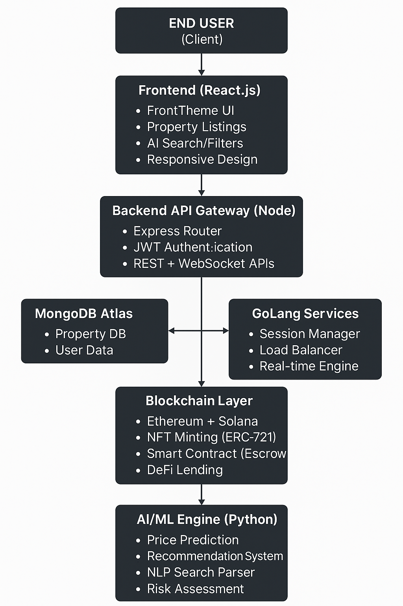

# 🏠 Real Estate Platform

A full-stack, AI-powered, blockchain-integrated real estate platform built using the **MERN stack**, **Python-based AI**, and **GoLang/Java microservices**, enabling smart property management, NFT real estate assets, and DeFi integration.

---

## 🚀 Features

### Outline diagram


### 🔹 Frontend (React.js)
- Dark Theme UI for modern aesthetics
- Property listings with filter and sort
- Real estate categories: Apartment, Hotel Apartment, Commercial, Administrative, Medical, Pharmacies
- AI-driven property search & recommendations
- Fully responsive and mobile-friendly
- Modular React component architecture
- Simple and clean UI/UX

### 🔹 Backend (Node.js API Gateway)
- RESTful + WebSocket APIs
- Express.js router structure
- JWT-based Authentication
- Secure session handling
- Scalable architecture
- Integration with AI, Blockchain, and GoLang/Java services

### 🔹 Database (MongoDB) [updating data]
- Property listings and metadata
- User profiles, history, and sessions
- Transaction records

### 🔹 Microservices (GoLang or Java) [Upcoming]
- Session management & monitoring
- Load balancing and concurrency handling
- Real-time event handling (bidding, messages, alerts)

### 🔹 Blockchain Layer [Upcoming]
- Tokenization of properties into NFTs (ERC-721)
- Ethereum & Solana support
- Smart contracts for rental/ownership/escrow
- DeFi mortgage/lending features

### 🔹 AI Engine (Python) [Upcoming]
- Property price prediction
- Investment risk scoring
- Recommendation engine
- NLP for smart search queries
- Virtual assistant (chatbot)

---

## 📦 Technologies Used

| Layer         | Technology                      |
|---------------|----------------------------------|
| Frontend      | React.js, Tailwind CSS           |
| Backend       | Node.js, Express.js              |
| Database      | MongoDB                     |
| Microservices | GoLang / Java (modular)          |
| Blockchain    | Ethereum, Solana, Solidity       |
| AI/ML         | Python (scikit-learn, pandas, NLP libraries) |

---

## 🛠️ Installation

```bash
# Clone repository
git clone https://github.com/Top-Real/prohouse.git
cd real-estate-platform

# Install Frontend
npm install

# Install Backend
npm install

# Running project
npm start
open the browser https://localhost:5173
# Setup Python AI Service
cd ../ai
pip install -r requirements.txt

# Run MongoDB locally or connect via MongoDB Atlas
